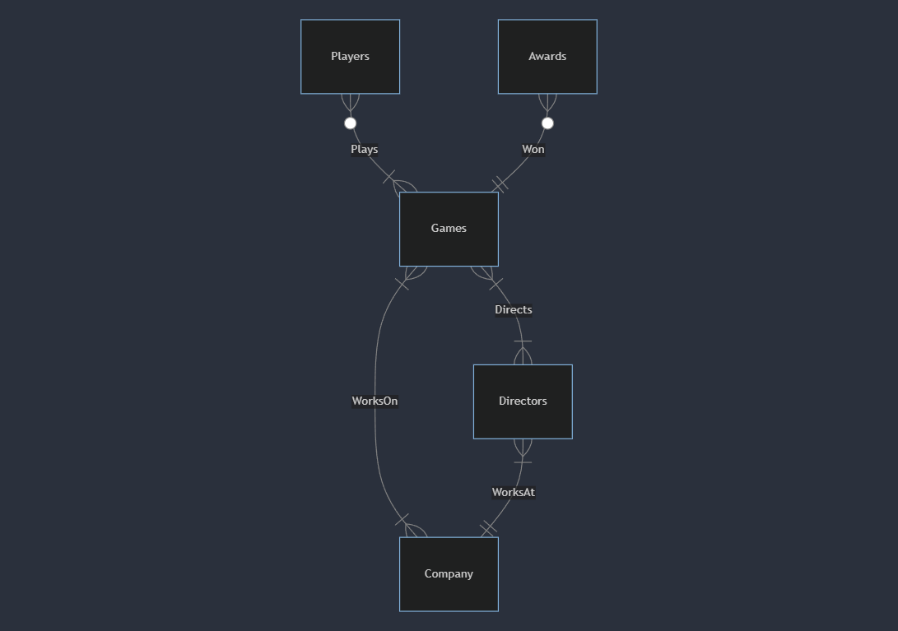

# Design Document for SteamGames DB

By Klenn Dungaran

Video overview: <[Youtube](https://youtu.be/FghSLxahTos)>

## Scope

The database contains all the necessary information about every video games on [Steam](https://en.wikipedia.org/wiki/Steam_(service)). Players should be able to track a game's rating, realtime playercount, and price. As such, included in the database's scope is:

* Video Games, including all the basic information (release year, price, genre etc.)
* Companies, which includes companies that developed and/or published a certain game
* Directors, including their basic personal information (name, birthdate, etc.), games they directed, and what company they work in
* Playercount, includes a track of realtime playercount of the video games
* Awards, includes the different awards games have won

Out of the scope includes:

* Individual players information
* Player's product reviews (written reviews)
* Games that are not on steam (e.g. PlayStation exclusive games, Early Access games)

## Functional Requirements

The database supports:

* Tracking all the games on Steam, including their price, playercount, and ratings.
* Checking the trending Steam games based on playercount and release year.
* Checking games that were developed/published by specific companies.
* Checking games that were directed by a specific director.
* CRUD operations for users.

The database is unable to do:

* Checking the revenues of the games.
* Check the current sales and news on steam.

## Representation

Entities are captured in MySQL tables with the following schemas.

### Entities

The database includes the following entities:

#### Games

The `Games` table includes:

* `id`, which specifies the unique ID for the game as an `INTEGER`. This column has the `PRIMARY KEY` constraint applied.
* `title`, which specifies the game's title as `VARCHAR(32)`. Thirty-two bytes should be sufficient for most titles.
* `release_year`, which specifies the game's release year as `YEAR`.
* `genre`, which specifies the game's genre as `VARCHAR(64)`. It has a `VARCHAR(64)` data type because a game can have multiple genres and 64 bytes should be enough if a game have a list of genres. You can find a list of genres [here](https://en.wikipedia.org/wiki/List_of_video_game_genres).
* `mode`, which represents the game's game mode as `ENUM('Singleplayer', 'Multiplayer', 'Both')`. The game mode can be `Singleplayer`, `Multiplayer` or `Both` if it supports either.
* `price`, represents the game's current price in USD as `DECIMAL(6, 2) UNSIGNED`. Prices has a limit range from 0 to 9999.99, which is enough for most steam games.
* `rating` corresponds to [steam's rating system](https://www.reddit.com/r/Steam/comments/ivz45n/what_does_the_steam_ratings_like_very_negative_or/). It is set as `ENUM(...)` with values ranging from `Overwhelmingly Positive` to `Overwhelmingly Negative`. You can visit the link for more info.

#### Companies

The `Companies` table includes:

* `id`, which specifies the unique ID for the company as an `INTEGER`. This column has the `PRIMARY KEY` constraint applied.
* `name`, which specifies the name of the company as `VARCHAR(32)`. Thirty-two bytes should be sufficient for most company names.
* `location`, which specifies the country the company is based as `CHAR(3)`. The data type `CHAR(3)` is used because we will be using [ALPHA-3](https://www.iban.com/country-codes) country codes.
* `year`, which represents the year the company was founded as `YEAR`.

#### WorksOn

The `WorksOn` table includes:

* `company_id`, which specifies the ID of the company as `INTEGER`. This column has the `FOREIGN KEY` constraint applied, referencing the `id` column in the `Companies` table.
* `game_id`, which specifies the ID of the game as `INTEGER`. This column has the `FOREIGN KEY` constraint applied, referencing the `id` column in the `Games` table.
* `role`, which specifies if the company published or developed a game as `ENUM('Publisher', 'Developer', 'Both')`. `Both` occurs when a company developed and published a game.

#### Directors

The `Directors` table includes:

* `id`, which specifies the unique ID for the director as an `INTEGER`. This column has the `PRIMARY KEY` constraint applied.
* `name`, which represents the full name of the director as `VARCHAR(32)`. Thirty-two bytes should be sufficient for most names.
* `birthdate`, which specifies the date of birth of the director as `DATE`.
* `nationality`, which specifies the nationality (e.g. American) of the director as `VARCHAR(16)`. Sixteen bytes should be sufficient.
* `company_id`, which specifies the ID of the company where the director works as an `INTEGER`. This column has the `FOREIGN KEY` constraint applied, referencing the `id` column in the `Companies` table, which ensures that each director works in a company.
* `title`, which specifies the role or title of the director in the company (President, CEO, etc.). It is represented as `VARCHAR(16)` where sixteen bytes should be enough.

#### Directs

The `Directs` table represent the games a director worked on. It includes:

* `director_id`, which specifies the ID of the director as an `INTEGER`. This column has the `FOREIGN KEY` constraint applied, referencing the `id` column in the `Directors` table.
* `game_id`, which specifies the ID of the game as `INTEGER`. This column has the `FOREIGN KEY` constraint applied, referencing the `id` column in the `Games` table.

#### Awards

The `Awards` table includes:

* `game_id`, which specifies the ID of the game that has won an award as an `INTEGER`. This column has the `FOREIGN KEY` constraint applied, referencing the `id` column in the `Games` table.
* `name`, which specifies the name or title (e.g. The Game Awards YYYY) of the award as `VARCHAR(32)`. Thirty-two bytes should be sufficient for most game award titles.
* `category`, which specifies the category (e.g. Game of the Year) of the award the game nominated for. `VARCHAR(32)` is used for the same reason as `name`.
* `year`, which specifies the year the game won the award as `YEAR`.

#### Players

The `Players` tracks the realtime playercount on hourly intervals. It includes:

* `game_id`, which specifies the ID of the game being tracked as an `INTEGER`. This column has the `FOREIGN KEY` constraint applied, referencing the `id` column in the `Games` table.
* `datetime`, which represent the current date and time the game is being tracked as `TIMESTAMP DEFAULT CURRENT_TIMESTAMP`.
* `players`, which specifies the number of players playing a game on a certain timestamp as `INT`.

### Relationships

The below entity relationship diagram describes the relationships among the entities in the database.

As interpreted by the diagram:

* A company is associated with one to many games. A company can develop/publish one game or multiple games of the same genre. At the same time, a game can be developed/published by one to many companies. It is one if the game is developed/published by only one company and many if the game is developed/published by a collaboration of companies.
* A director can direct one to many games. A director can direct multiple games with the same genres. At the same time, a game can have one to many directors. It can have multiple directors if the directors collaborated with each other on one game.
* A director can work on one and only one company. At the same time, a company can have one to many directors.
* One game can have 0 to many players. It can have 0 players if no players play a certain game, and it can have many players if multiple players play one game. At the same time, a player can play one to many games.
* One game can have 0 to many awards. It can have 0 awards if the game has not won an award, and it can have many awards if it has won more than one award or the same award in different categories. An award is given to one and only one game.

## Optimizations

Based from the queries in `queries.sql`, it is common for users of the database to access a game's title, release year, genre, price, and rating. For that reason, indexes are created on the columns that represents them to speed up the process.

It is also common for a user of the database to find out the player count of a particular game within a range of time. As such, an index is created on the `datetime` column in the `Players` table to speed the identification of datetime by games.

Lastly, it is typical for users to find out the games created by certain company and/or director. Thus, an index is created on the `name` column in both the `Companies` and `Directors` table.

## Limitations

The current database does not include the number of ratings for a game or how the values in the `rating` column were determined. Complex formulas are needed to explain this aspect more thoroughly.
